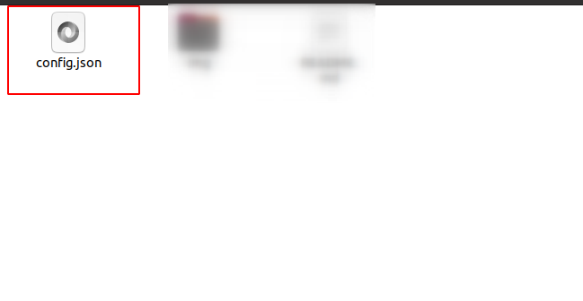

# **Automate User Account Creation Script**

## **Objective**

The objective for this task it's create a script on python to create multiple users on linux this script will must contain the username, password user, home directory and shell.

## **Materials**

For do this task we will need:

- Python installed, in this case **"python 3.10"** 
-  S.O Linux, in this case **"ubuntu 20.04"**

## **INDEX** 
+ [Develoment](#development)
  + [1. Configuration File](#1-create-the-configuration-json-file)
    + [1.1  (OPTIONAL FILE)](#11-optional-configuration-file-b)
  + [2.]()

+ [Comprobations]
+ [Create User Script](/task2/create_user/)
+ [(Optional) Delete User Script](/task2/remove_user/)

## **Development**

## **1. Create the configuration json file**

First of all, we will create a .json file in this case "config.json" to create users:



  
### **1.1 Explanation of content**

  And this will contain:
  - **"users"** : This key will contain all the users that will be created. It is likely that the value of this key will be a list or an array that will hold all the user objects, each with their own set of properties such as "username", "password", etc.
  > **Example**:
  >
  >```json
  >{
  >   "users":[
  >       {
  >         "username":"...",
  >          "password":"..."
  >       }
  >    ]
  >}
  >```
  - **"username"**: This key will define the username to be created for a user. The value of this key will be a string that specifies the username.
  > **Example:**
  > ```json  
  >{ "..."
  >
  >   "username": "example",
  >    "..."
  >}
  > ```
  - **"password":** This key will define the password of the user. The value of this key will be a string that specifies the password. It is **important** to note that passwords should always be stored in an encrypted form to maintain security.
  > **Example:**
  > ```json  
  >{ "..."
  >
  >   "password": "pass123",
  >    "..."
  >}
  > ```
  - **"shell"**: This key will define which shell the user will use. The value of this key will be a string that specifies the shell. Shells are used to interact with the operating system and execute commands.
  > **Example:**
  > ```json  
  >{ "..."
  >
  >   "shell": "/bin/bash",
  >    "..."
  >}
  >```
  - **"home_dir"**: This key will create a home directory for the user. The value of this key will be a string that specifies the path where the home directory will be created, usually in the format of "/home/username". The home directory is the default working directory for the user when they log in to the system
  > **Example:**
  > ```json  
  >{ "..."
  >
  >   "home_dir": "/home/username",
  >    "..."
  >}
  > ```
  >**IMPORTANT:** The home dir must be the same as the username, otherwise it could cause problems.
### **1.2 Example of an entire configuration file**

```json
{
        "users": [ 
          {
            "username": "Zipi",
            "password": "1q2w3e4r5t6y",
            "shell": "/bin/bash",
            "home_dir": "/home/bob"
          },
          {
            "username": "Zape",
            "password": "1y2t3r4e5w6q",
            "shell": "/bin/bash",
            "home_dir": "/home/sponge"
          }
        ]
}
```


## **2. Create the script python: Create user**

### **2.1 Modules we will need**

  To create the python script we will need the following modules:
  
  ```python
  import json
  import os
  import subprocess
  import crypt
  ```
  
  - **json**: We import this module to read de config.json file for the configurations.
  
  - **os**:  We import this module to create some conditions to execute the script
  
  - **subprocess**: We import this module to run the command to create the users.
  
  -  **crypt**: We import this module to encrypt the password`s users to create
  
### **2.2 Conditions to run the script**

  To run this script we will need be a privileges user `root`. So for achivement we will create the following condition on the script

  ```python
  if os.geteuid() != 0:
      print("Error: This script must be run with root privileges.")
      exit()
  ```

### **2.3 Load the Configuration**

  The next step it will be load the configuration of the json file. So to do that we add the following lines.

  > In my case my configuration file it's called config.json

  ```python 
  with open('config.json') as f:
      users_data = json.load(f)
  ```

  And this configuration file will be call as `user_data` on the python script.

### **2.4 Creating Users**

Next, we will use the configurations loaded from the `config.json` file to create Unix users using the `useradd` command. We will use a `for` loop to iterate through the list of users, and for each user we will extract the `username`, `password`, `shell`, and `home_dir` values.

We will then use these values to construct the `useradd` command and execute it using the `subprocess.run` function. Here is the command we will use:

```
useradd -m -p encrypted_password -s shell -d home_dir username
```

Where `encrypted_password` is the password for the user, encrypted using the `crypt` module, and `username`, `shell`, and `home_dir` are the values extracted from the `config.json` file.

Here is the code to implement this:

```python
# Create users
for user in users_data['users']:
    username = user['username']
    password = user['password']
    salt = "saltstring"
    encrypted_password = crypt.crypt(password, salt)
    shell = user['shell']
    home_dir = user['home_dir']
    
    # Construct and execute the `useradd` command to create the user with specified shell and home directory
    command = ['useradd', '-m', '-p', encrypted_password, '-s', shell, '-d', home_dir, username]
    subprocess.run(command)
    
    print(f"Created user '{username}' with password '{password}', shell '{shell}', and home directory '{home_dir}'")
```

> Note that we construct the `useradd` command as a list of strings, and pass this list to the `subprocess.run` function to execute the command. The `print` statement is used to report each user that is created.

### **2.5 Example of an entire script**

```python
import os
import json
import subprocess
import crypt

if os.geteuid() != 0:
    print("Error: This script must be run with root privileges.")
    exit()


# Read the JSON configuration file
with open('config.json') as f:
    users_data = json.load(f)

# Create users
for user in users_data['users']:
  # Extract the username from configuration file 
    username = user['username']
  # Extract the password from configuration file   
    password = user['password']
  # Encrypt the password  
    salt = "saltstring"
    encrypted_password = crypt.crypt(password, salt)
  # Extract the shell from configuration file   
    shell = user['shell']
  # Extract the home_dir from configuration file   
    home_dir = user['home_dir']
  # Run the `useradd` command to create the user with specified shell and home directory
    subprocess.run(['useradd', '-m', '-p', encrypted_password, '-s', shell, '-d', home_dir, username])
    print(f"Created user '{username}' with password '{password}', shell '{shell}', and home directory '{home_dir}'")
```

**3\. Delete User Accounts in Python (OPTIONAL)**
-------------------------------------------------

### **3.1 Configuration File**

To simplify and speed up the process of deleting user accounts, a script has been created that reads a configuration file called **config.json**. The configuration file only contains the **names of the users** to remove, as shown in the example below:

css

```css
[    "Zipi",    "Zape"]
```

### **3.2 Script**

This Python script uses the following steps:

1.  Imports the necessary modules: subprocess, json, and os.
    
2.  Checks whether the script is being run with root privileges using the os.geteuid() function, which returns the effective user ID of the current process.
    
3.  Reads the usernames to be deleted from a JSON configuration file called **config.json** using the json.load() function and stores them in a list called **usernames**.
    
4.  Iterates over the list of usernames and constructs a userdel command to delete each user account. The **cmd** variable holds the userdel command as a string with options **\--remove** and **\--force** to remove the user's home directory and any files it contains. The **split()** method is used to split the command string into a list of arguments that can be passed to subprocess.run().
    
5.  Calls subprocess.run() to execute the userdel command with the arguments passed as a list. The **check=True** argument ensures that an error is raised if the command fails.
    
6.  Checks whether the user was successfully deleted by running the id command with the subprocess.run() function. If the id command raises a CalledProcessError, the user was successfully deleted, and a success message is printed to the console. Otherwise, an error message is printed indicating that the user deletion failed.
    
7.  Overall, this script reads a list of usernames to be deleted from a JSON configuration file, deletes the users and their home directories using the userdel command, and reports whether each user was deleted successfully or not. It also checks if the script is being run with root privileges to ensure that the userdel command can be executed.
    


```python
import subprocess
import json
import os

# Check if script is being run with root privileges
if os.geteuid() != 0:
    print("Error: This script must be run with root privileges.")
    exit()

# Read the configuration file
with open('config.json', 'r') as f:
    usernames = json.load(f)

# Delete the user accounts
for username in usernames:
    cmd = f"userdel {username} \
           --remove \
           --force"

    subprocess.run(cmd.split(), check=True)

    # Check if the user was deleted
    try:
        subprocess.run(f"id {username}".split(), check=True)
        print(f"Error: Failed to delete user {username}.")
    except subprocess.CalledProcessError:
        print(f"User {username} was deleted successfully!")
```

### **Comprobation of his correct funtion**


