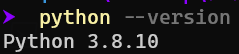
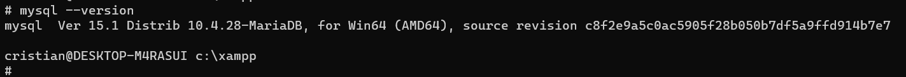
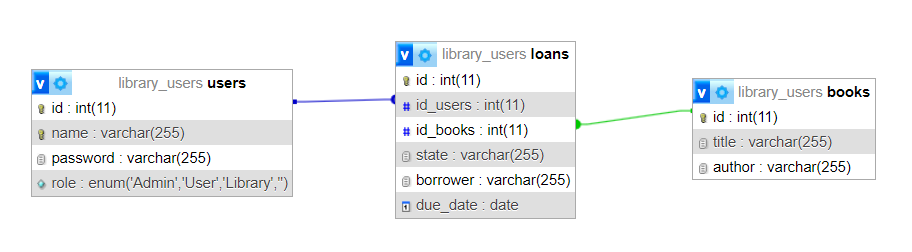
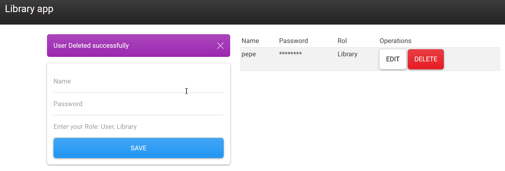
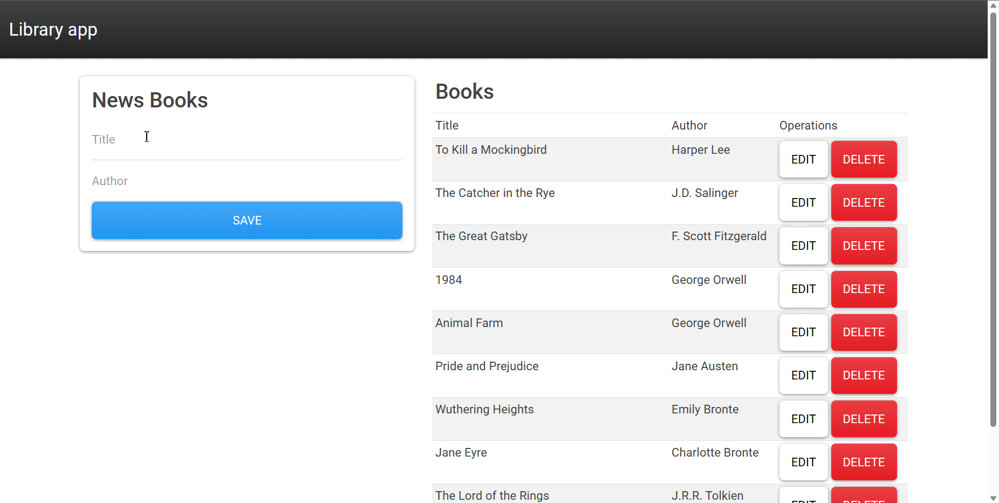
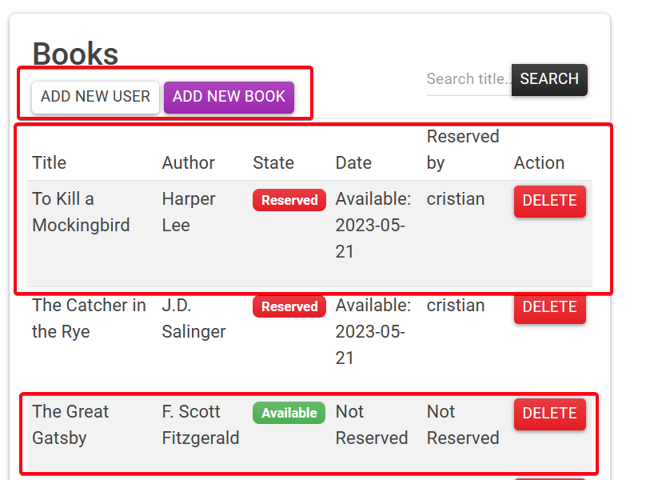
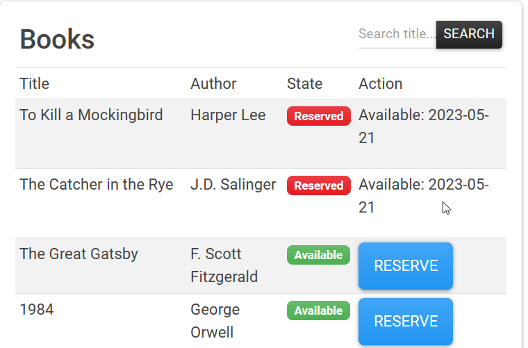
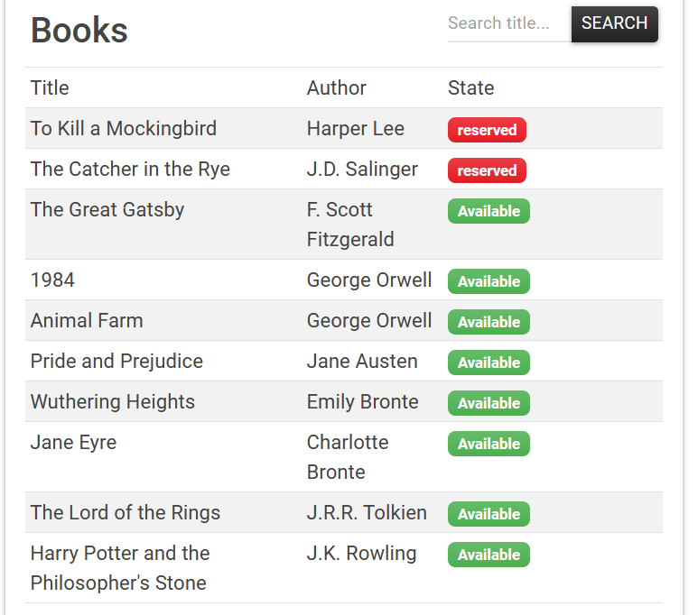
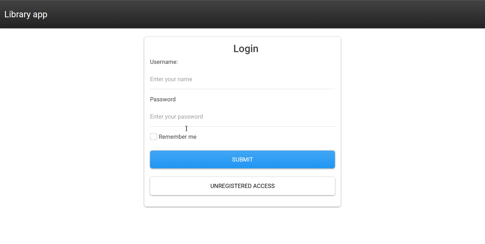

# Library app

**Author:** Cristian M. Hdez Cruellas

## Index

[Introduction](#introdution)

1. [Requirements for the app](#1-requirements-for-the-app)

2. [MySQL Configuration](#2-mysql-configuration)

3. [Users configuration and roles](#3-users-configuration-and-roles)

4. [Books management](#4-books-management)

5. [Login configuration](#5-login-configuration)


## Introduction

In this task, we have developed a web app in python for a library in which you can create different types of users with their different roles, add, modify and delete new books or reports, and be able to reserve said books for a period of time.


## 1. Requirements for the app

For this web application works correctly it is necessary to have the following installed:

- Python 3 installed

    

- MySQL installed

    

- The following python libraries

    - Flask
    - Flask-mysqldb
    - Werkzeug
    - MySQL-python

```shell
pip install flask flask-mysqldb Werkzeug MySQL-python
```

## 2. MySQL Configuration

In order for the management of the books, of the users and the reservation to be as orderly as possible, I decided to use mysql for it.

> **Note**: As this is an example of a web app, the password and security are basic.

First of all, I create a new database called `library_users` and a new user of the database to management called `librarian_admin`.

The database will have the following structure:



You can download the `MySQl database source` [here]()

And you can download the `librarian_admin` setup [here]()

## 3. Users configuration and roles

We created some definitions to create, modify and delete the users, also we defined some roles to the differents users.

| Role             | Use                                                                                                                                                                                                                                                           |
|------------------|---------------------------------------------------------------------------------------------------------------------------------------------------------------------------------------------------------------------------------------------------------------|
| Librarian        | - Add, edit, and delete books in the library catalog<br>- Register new users and manage their accounts.<br>- Perform loans and returns of books.                                                                                                            |
| User             | - Search and consult the library catalog.<br>- Request book loans and make returns.<br>- Reserve books that are on loan.                                                                                                                                      |
| Unregistered User| - Search and consult the library catalog.<br>- View availability and basic information of books.<br>- Access public resources, such as online catalogs or general library information.|


The definition to create the user it's the next one:

```python
def add_user():
    if request.method == 'POST':
        name = request.form['name']
        password =request.form['password']
        hashed_password = generate_password_hash(password)
        role = request.form['role']
        cur = mysql.connection.cursor()
        try:
            cur.execute('INSERT INTO users (name,password,role) VALUES (%s, %s, %s)',
                        (name, hashed_password, role))
            mysql.connection.commit()
            flash('User Added successfully')
```

The definitions to modify the user it's the next one:

```python
@app.route('/edit_user/<string:id>')
def get_user(id):
    cur = mysql.connection.cursor()
    cur.execute('SELECT * FROM users WHERE id = %s', (id,))
    data = cur.fetchall()
    return render_template('edit_user.html', user = data[0]) 

@app.route('/update_user/<string:id>', methods = ['POST'])
def update_user(id):
    if request.method == 'POST':
        name = request.form['name']
        password =request.form['password']
        role = request.form['role']
        cur = mysql.connection.cursor()

        # Obtain the encrypted password for the user selected
        cur.execute('SELECT password FROM users WHERE id = %s', (id,))
        result = cur.fetchone()
        hashed_password = result[0]

        # Desencrypt the password and verify if the new password matches the previous password
        if check_password_hash(hashed_password, password):
            flash('The new password should be different from the current one')
            return redirect(url_for('get_user', id=id))
        
        hashed_password = generate_password_hash(password)

        
        cur.execute('''
        UPDATE users
        SET name = %s,
            password = %s,
            role = %s
        WHERE id = %s
        ''', (name,hashed_password,role,id,))
        flash ('User Updated Successfully.')
        mysql.connection.commit()
        return redirect(url_for('User'))
```

The definition to delete the user it's the next one:

```python
@app.route('/del_user/<string:id>')
def del_user(id):
    cur = mysql.connection.cursor()
    cur.execute('DELETE FROM users WHERE id = {0}'.format(id))
    mysql.connection.commit()
    flash('User Deleted successfully')
    return redirect(url_for('User'))
```

And finally, an example of how it works:



Now, we can see how it works, at first we created the user `juan` like a `normal` user, then we modified this user and changed the `role` to `Librarian` and we deleted.


## 4. Books management

We created some definitions to create, modify or delete books/reports works similar to user setup.

The definition to create the books it's the next one:

```python 
@app.route('/add_book', methods=['POST'])
def add_book():
    if request.method == 'POST':
        title = request.form['title']
        author =request.form['author']
        cur = mysql.connection.cursor()
        cur.execute('INSERT INTO books (title,author) VALUES (%s, %s)',
                    (title, author))
        mysql.connection.commit()
        flash('Book Added successfully')
```

The definition to modify the books it's the next one:

```python

@app.route('/edit_book/<string:id>')
def get_book(id):
    cur = mysql.connection.cursor()
    cur.execute('SELECT * FROM books WHERE id = %s', (id,))
    data = cur.fetchall()
    return render_template('edit_book.html', book = data[0]) 

@app.route('/update_book/<string:id>', methods = ['POST'])
def update_book(id):
    if request.method == 'POST':
        title = request.form['title']
        author =request.form['author']
        cur = mysql.connection.cursor()
        cur.execute('''
        UPDATE books
        SET title = %s,
            author = %s
        WHERE id = %s
        ''', (title, author, id,))
        flash ('Book Updated Successfully.')
        mysql.connection.commit()
        return redirect(url_for('Book'))

```

The definition to delete the books it's the next one:


```python

@app.route('/del_user/<string:id>')
def del_user(id):
    cur = mysql.connection.cursor()
    cur.execute('DELETE FROM users WHERE id = {0}'.format(id))
    mysql.connection.commit()
    flash('User Deleted successfully')
    return redirect(url_for('User'))

```

And finally, an example of how it works:




## 5. Login configuration

Depending on the type of user who logs in, they will have differents options to do on this server app. 

- **Librarian**

    Using this rol we will have the control and state of the loans, for example:"who reserve "x" book/report", users management, books manages and loans management. Below you can found a demo:

    


- **User**

    Using this rol we will have the control to reserve books, and see the state of the differents books. Below you can found a demo:

    


- **Unregistered User**

    Using this rol we will can see the state of the differents roles.

    


And finally a gif of how it works:

    

In case, you want to download this app to use it [click here.]()